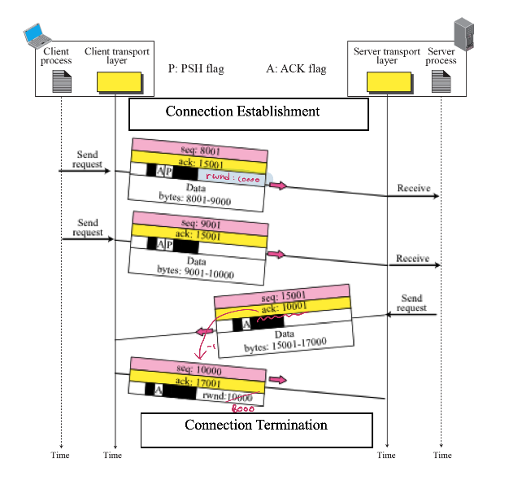

# TCP(Transmission Control Protocol)

## TCP 서비스
- 연결 지향의 신뢰성이 있는 바이트 스트림 서비스를 제공한다.
- 양방향 통신을 지원한다.(Full-Duplex Communication)
- 흐름제어와 에러제어, 그리고 혼잡제어를 제공한다.

## 바이트 스트림 서비스란?
> 데이터 송 수신시 버퍼 기능을 이용해 Byte 단위로 처리

TCP는 데이터 송/수신시 버퍼를 이용하기 때문에 흐름제어를 할 수 있다.

## Connection Oriented Protocal(연결 지향 프로토콜)

연결지향 프로토콜은 다음과 같은 3가지 단계를 거치게 된다.
1. 연결
2. 데이터 전송
3. 연결 종료

## 3-way handskaing

1. 클라이언트가 서버로 SYN 패킷을 보낸다. 그리고 클라이언트는 SYN/ACK응답을 기다리는 SYN_SENT상태가 된다.
2. 서버는 SYN요청을 받고 클라이언트에게 요청을 수락한다는 ACK와 SYN flog가 설정된 패킷을 발송하고 클라이언트가 ACK로 응답하기를 기다린다. 서버는 SYN_RECEIVED 상태가 된다.
3. 클라이언트는 서버로 ACK를 보내게 되면 서버와 클라이언트가 연결이 이루어진다. 서버 상태는 ESTABLISHED가 된다.

> SYN(클라이언트) -> SYN/ACK(서버) -> ACK(클라이언트)  
> SYN_SENT(클라이언트) -> SYN_RECEIVED(서버) -> ESTABLISED(서버)  

## 데이터 전송

## 4-way handshaking

1. 클라이언트가 연결을 종료하겠다는 FIN 패킷을 전송한다.
2. FIN 패킷을 받은 서버는 클라이언트에서 서버로 데이터를 전송하는 연결을 끊는다. 서버에서 클라이언트로 데이터를 전송하는 연결은 아직 살아있다.(Half-closed)
3. 서버에서 클라이언트로의 통신이 끝나게 되면 서버에서 FIN 패킷을 전송한다.
4. FIN 패킷을 받은 클라이언트는 마지막으로 ACK패킷을 보내게 되면 연결이 끊기게 된다.

## TCP에 사용되는 flag(control field)

- URG(Urgent) : urgent data가 존재함을 알려준다. urgent data는 다른 데이터를 무시하고 바로 process로 보내진다.
- ACK(Acknowledgment) : 확인을 위한 flag
- RST(Reset the connection) : 비정상적으로 connection을 끊을 때 사용한다.
- SYN(Synchronize sequence numbers) : TCP를 이용해 연결을 만들 때 사용하는 flag
- FIN(Terminate the connection) : TCP 연결을 끊을 때 사용한다.