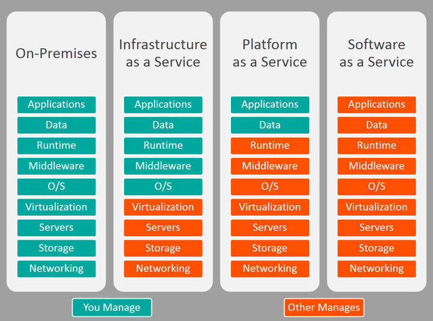

# 클라우드 서비스

## 클라우드 서비스 종류

## IaaS(Infrastructure as a Service)

인프라를 제공하는 방식 - 컴퓨터를 대여해주는 거라고 생각하면 이해하기 쉽다. 아마존의 AWS, MS의 Azure, 구글의 GCP

## Platform as a Service

플랫폼을 제공하는 방식 - IaaS 서비스에 Runtime환경까지 설정이 이미 되어 있기 때문에 

## Software as a Service

특정 소프트웨어를 제공하는 방식 - 드랍박스, 구글 Docs, 오피스365

## 장점
- 컴퓨팅 환경을 빠르게 구축할 수 있다는 장점이 있다.
- 사용한 만큼만 돈을 지불하면 된다.
- 특정기간 트래픽이 폭주하는 경우에 자원의 리소스 추가와 삭제가 기존의 on-premise방식에 비해 용이하다.
- 서버를 관리하기 위한 물리적 공간과 인적 자원에 대해 신경쓸 필요가 없어진다.

## 단점
- 트래픽처리에 따른 초과비용 위험
- 보안 이슈 - 자사의 프라이빗 서버에 저장하는것이 다른 외부인이 볼 수 있다는 단점이 있다.