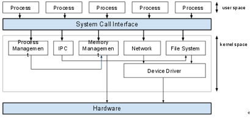

# Inter Process Communication(프로세스간의 통신)

## 프로세스간의 통신이란?
- 프로세스간의 데이터 및 정보를 주고 받기 위한 메커니즘
- kernel에서 IPC를 위한 도구를 제공하며, system call형태로 프로세스에게 제공이 된다.

## 왜 IPC가 필요한가?
각각의 프로세스는 `독립된 실행 객체`이기 때문에 특별한 조취를 취하지 않는 이상은 서로간의 통신이 어렵기 때문에 kenerl에서 프로세스간의 통신을 위한 IPC을 제공하는 것이다.

## 공유 메모리 (Shared Memory)

- 이 공간에는 데이터가 어떤 형식인지, 어떤 위치에 저장되는지에 대해 운영체제가 관여하지 않는다.

### 장점
- 빠르다.

### 단점
- Producer - Consumer 문제가 발생한다.
- 

## 메시지 전달(Message Passing)

커널을 경유해 메시지를 주고 받는다. 커널에서 하는 역할은 메시지들을 버퍼해주는 역할을 한다.

### 장점
구현하기가 쉽다.

### 단점
메시지를 전달하기 위해서는 커널을 거쳐야하기 때문에 속도가 느리다.

## Race Condition(경쟁상태)

<image src=images/race_condition.png width = 400>

`공유자원`에 여러개의 프로세스가 접근할 때 방생한다. 여러 프로세스가 공유데이터에 동시에 접근할 때 `실행순서`에 따라서 실행 결과가 달라지는 현상이다.

## Critical Regions(임계 영역)

프로세스의 코드 부분에서 공유 자원에 들어가기 위한 코드부분을 임계영역(Criticla Regions)이라고 부른다.

## 교착 상태

- 상호배제
- 점유대기
- 비선점
- 순환대기

> 위 4가지 조건을 동시에 만족해야 교착상태라고 부른다.

# 상호 배제(Mutual Exclusion)
- Busy Waiting
- Sleep and WakeUp
- Semaphore(세마포어)
- Mutex(뮤텍스)
- Monitor
- Message Passing
- Barriers

## Semaphore(세마포어)

공유된 자원의 데이터에 한번에 여러 프로세스가 접근하지 못하게 하는 알고리즘, 

- 이진 세마포어(binary semaphore)
- 계수형 세마포어(counting semaphore)

## 뮤텍스

Locking 매커니즘을 사용
공유된 자원의 데이터에 한번에 여러 쓰레드가 접근하지 못하게 하는 알고리즘

## 모니터

