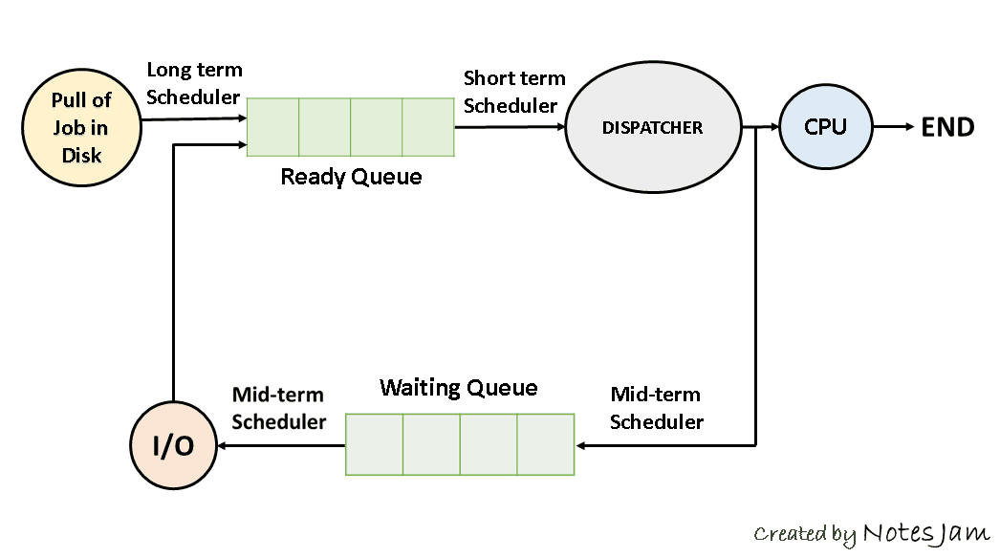

# 스케쥴러

## 목표
- 스케줄링의 의미를 알 수 있다.
- 스케줄링 종류를 알 수 있다.
- 각각의 스케줄링이 어디서 어떤 역할을 하는지 이해할 수 있다.

## 스케줄링이란

> 스케줄링란 os내에서 프로세스에게 cpu 위에서 실행될 수 있도록 제어해주는 프로그램

프로세스를 스케쥴링하기 위한 queue에는 세가지 종류가 존재한다.
- Job Queue : 현재 시스템 내에 있는 모든 프로세스의 집합
- Ready Queue : 현재 메모리 내에 있으면서 CPU를 잡아서 실행되기를 기다리는 프로세스의 집합
- Device Qeueu : Device I/O 작업을 대기하고 있는 프로세스의 집합

## 장기 스케줄러 (메모리 적재)

> 디스크에서 프로그램을 선택해 메모리로 적재하는 역할을 한다.

한정된 메모리에 많은 프로세스들이 한꺼번에 올라올 경우, 대용량 메모리(디스크)에 임시로 저장된다. 대용량 메모리에 저장된 프로세스 중에서 어떤 프로세스에 메로리를 할당하여 ready queue로 보낼지 결정하는 역할을 한다.

- 메모리와 디스크 사이의 스케줄링을 담당한다.
- 프로세스에 memory 및 각종리소스를 할당한다.
- 다중 프로그래밍 제어

## 단기 스케줄러 (cpu 할당)

> 프로세스에 CPU를 할당해 프로세스를 실행하기 위한 역할을 한다.

- Ready Queue에 존재하는 프로세스 중 어떤 프로세스를 run할지 결정한다.
- cpu와 메모리 사이의 스케줄링을 담당한다.
- 프로세스의 상태 : ready -> running -> waiting -> ready

## 중기 스케쥴러 (메모리 관리)

> 시스템 성능저하를 방지하기 위해 메모리에 적재된 프로세스의 수를 동적으로 저절하기 위한 스케쥴러

- 프로세스에게서 memory를 deallocate한다.
- 현 시스템에서 메모리에 너무 많은 프로그램이 동시에 올라가는 것을 조절한다.
- 다중 프로그래밍의 정도를 완화
- 프로세스의 상태 : ready -> suspended