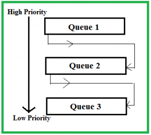

# 스케줄링 알고리즘

## 학습 목표
- 비선점 방식과 선점 방식에 대해 이해할 수 있다.
- 비선점 스케줄링 알고리즘의 종류에 대해 알 수 있다.
- 선점 스케쥴링 알고리즘의 종류에 대해 알 수 있다.

## 선점과 비선점

## 비 선점 스케쥴링

> 실행 중인 프로세스로 부터 CPU 자원을 뺏어 올 수 없다.

즉, 한 프로세스에 CPU가 할당이 되게 되면 해당 작업이 끝나거나 대기상태로 전활될 때까지 CPU자원을 계속해서 차지하게 하는 방법이다.

### FCFS(First Come, First Served) - 들어온 순서
우리가 생각하는 queue의 First In Fist Out 개념과 같다. 작업 큐에 들어온 순서대로 CPU자원을 할당해주는 방식이다.

#### 장점
구현이 엄청 단순하고 처리 순서가 확실하다.(확실한 작업 처리를 보장 받을 수 있다.)

#### 단점
Convoy Effect가 생길 수 있다.

> Convoy Effect : 긴 작업시간을 요구하는 프로세스 때문에 간단히 끝낼 프로세스가 자원을 할당 받지 못하는 상황이다.

### SJF(Shortest Job First) - 처리시간이 짧은 순서

작업시간을 기준으로 일처리를 해주는 알고리즘이다.  

- Ready Qeueu에 있는 프로세스들을 작업시간을 기준으로 우선순위를 정한다.(우선순위 큐 사용)
- 작업시간이 가장 짧은 프로세스가 자원을 할당 받는 형식으로 작업을 한다.

#### 장점
Average Waiting Time이 줄어든다는 장점이 있다.(빨리 빨리 작업이 끝나기 때문에)

#### 단점
Starvation이 생길 수 있다.(해결법 : Aging)

> Starvation : 작업시간이 무진장 길어 메모리상에 계속해서 프로세스가 존재하는 상태, 잘 못했다가는 영구적으로 자원을 할당받지 못하고 갖혀 있을 수 있다.

> Aging : 작업시간으로만 우선순위를 메기는 것이 아닌 들어온 시간으로도 우선순위를 메기는 방식이다. 덕분에 오래 남아 있는 프로세스들도 자원을 할당받을 수 있다.

### HRN(Hightest Response ratio Next) 스케줄링
SJF의 단점을 보완한 알고리즘, `처리시간`과 `대기시간`을 모두 고려해 우선순위를 정한다. `처리시간`과 `대기시간`을 고려한 공식을 적용한다.

> (대기시간 + 처리시간) / 처리시간  
> 대기시간이 길어지면 길어질 수록 높은 우선순위를 가질 수 있다.

### Multi 

## 선점 스케줄링

> 실행 중인 프로세스로부터 CPU 자원을 뺏어 올 수 있다.

즉, 작업중인 프로세스를 중지시키고 CPU자원을 차지할 수 있도록 하는 방법이다.

### RR(Round Robin) 스케줄링

- FCFS알고리즘을 선점 스케줄링 형식으로 바꾼 버전이다.
- 보통 시분할 시스템에서 사용이된다.
- 할당되는 시간이 커지면 커질 수록 FCFS알고리즘과 비슷해진다.

### SRT(Shortest Temainint Time)

- SJF알고리즘을 선점 스케줄링 형식으로 바꾼 버전

### MLQ(Multi Level Queue : 다단계 큐)

<image src = "images/multilevel_queue.jpg" width = "500">

작업들을 여러 종류의 Ready queue로 구분하여 스케쥴링하는 기법

### MFQ(Multi Level Feedback Qeueu : 다단계 피드백 큐)

- MLQ에서 생길 수 있는 Starvation을 보완한 스케줄링 기법.
- 우선숨위가 가장 낮은 큐는 FCFS 또는 RR을 사용하고 나머지는 모두 RR스케줄링을 사용한다.
- 우선순위가 높은 큐일수록 짧은 Time Slice를 주고 해당 Time Slice내에 못 끝내게 될 경우 우선순위가 한단계 낮은 큐로 보내진다.
- 반대로 일정시간동안 실행되지 못하고 남아있는 프로세스의 경우 우선순위가 한단계 높은 큐로 보내준다.