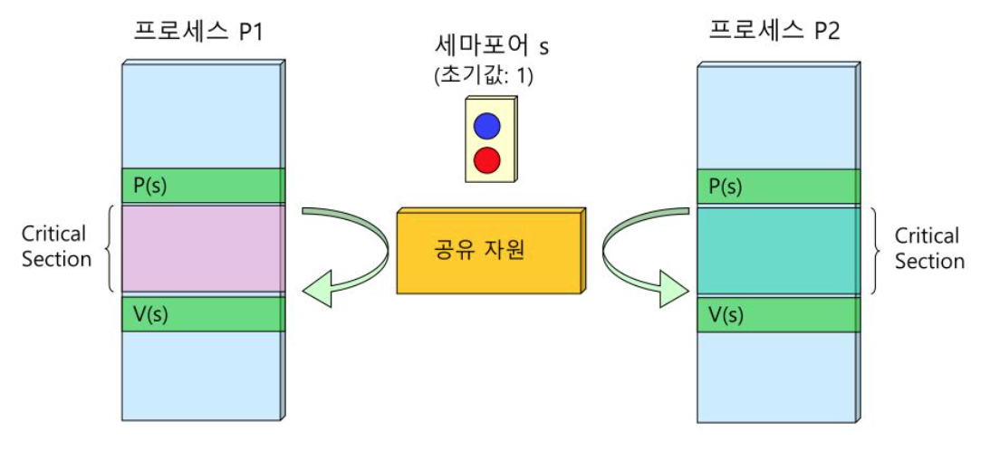
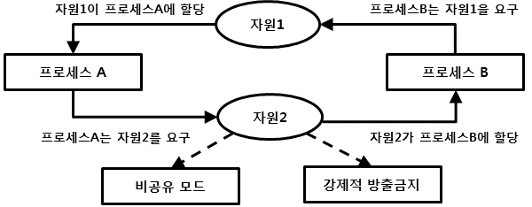
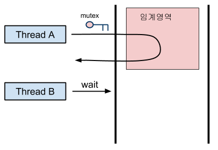
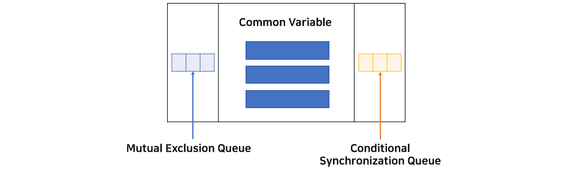

# 프로세스 동기화

`공유자원`에 접근하는 여러 프로세스들이 `치리순서`에 상관없이 같은 결과를 얻을 수 있음을 보장하기 위해 도입된 개념, 이를 통해 공유되는 `데이터의 일관성`을 보장한다.
쉽게 말해, 하나의 프로세스가 공유자원을 사용하고 있을 때, 다른 프로세스가 공유자원을 사용허지 못하도록 하는 것이다.

> 데이터의 일관성을 보장하기 위해서

## Race Condition(경쟁상태)

<image src=images/race_condition.png width = 400>

`공유자원`에 여러개의 프로세스가 접근할 때 방생한다. 여러 프로세스가 공유데이터에 동시에 접근할 때 `실행순서`에 따라서 실행 결과가 달라지는 현상이다.

## Critical Regions(임계 영역)

프로세스의 코드 부분에서 `공유 자원`에 들어가기 위한 코드부분을 임계영역(Criticla Regions)이라고 부른다.

## 교착 상태

- 상호배제
- 점유대기
- 비선점
- 순환대기

프로세스로부터 자원을 빼앗지 못하는 `비선점`의 상황과 한 자원에 여러 프로세스가 동시에 접근하지 못하는 `상호배제`의 상태에서 자원1을 사용하는 프로세스A가 프로세스B가 사용하는 자원2를 요청할 경우 자원을 할당 받을 때까지 자원1을 가진 상태로 대기에 들어가는 `점유 대기`상태가 된다. 이 때 프로세스B또한 프로세스A가 사용하는 자원1을 요청하게 되면 프로세스 B역시 `점유 대기`상태로 들어가는데, 결국, 서로 상대방의 자원을 요청하는 사이클이 발생하는 `순환대기` 상태를 보이게된다

> 위 4가지 조건을 동시에 만족해야 교착상태라고 부른다.

# 상호 배제(Mutual Exclusion)
- Busy Waiting
- Sleep and WakeUp
- Semaphore(세마포어)
- Mutex(뮤텍스)
- Monitor
- Message Passing
- Barriers

## Semaphore(세마포어)

공유된 자원의 데이터에 한번에 여러 프로세스가 접근하지 못하게 하는 알고리즘, 

- 이진 세마포어(binary semaphore)
- 계수형 세마포어(counting semaphore)

## 뮤텍스

Locking 매커니즘을 사용
공유된 자원의 데이터에 한번에 여러 쓰레드가 접근하지 못하게 하는 알고리즘

## 모니터

- 주로 고급 언어에서 이 기능을 지원한다.
