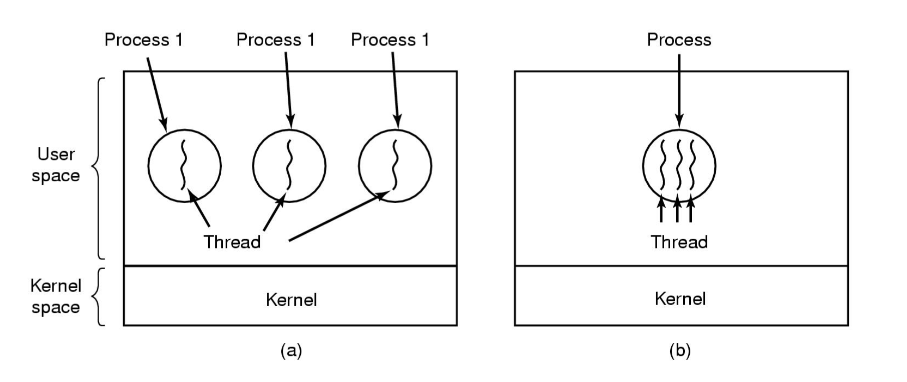

# Thread

- CPU에서 실행되는 실행되는 실행 단위
- 한 프로세스 내에 여러개의 쓰레드가 존재할 수 있다.
- 같은 프로세스환경에서 여러개의 쓰래드가 동일하게 발생할 수 있다.(멀티 쓰레드)

a) 하나의 프로세스에 하나의 쓰레드가 존재하는 경우
- 각각의 프로세스는 독립적으로 움직인다.  

b) 하나의 프로세스내에 여러가지 쓰레드가 존재하는 경우(multi thread)  
- 쓰레드는 결국 프로세스내의 수행 단위이기 때문에 프로세스단의 Address Space들을 공유한다.  
- 대신, 각각의 쓰레드마다 PC(Program Counter), register, stack을 갖는다.  
- 각각의 쓰레드는 하나의 프로세스를 수행하기 위해 상호 협력적인 관계를 갖는다.  

## 쓰레드와 관련된 Procedures

- thread_create(새로운 쓰레드를 생성)
- therad_exit
- thread_wait
- thread_yield(thread에만 있는 개념)

## 쓰레드를 사용하는 이유
- 많은 앱에서 한번에 여러가지 일을 수행하는 경우
- 쓰레드가 프로세스보다는 생성과 소멸시키는게 더 쉬워서
- performance에 대한 이점을 얻을 수 있다.
- multiple CPU환경에서는 진짜로 병렬을 구현할 수 있다.

## 쓰레드를 구현하는 방법
쓰레드는 `User Space`에서 그리고 `Kernel`에서 구현을 할 수 있다.
- User Space에서 쓰레드를 구현할 경우 User Level Thread
- Kernel 영역에서 쓰레드를 구현할 경우 Kernel Level Thread라 부른다.

### User Level Thread

<image src=images/user_level_thread.png width = 400>

User Level Thread의 경우 Kernel은 Process table을 가지고 있어 Process에 대한 정보를 가지고 있지만 Thread Table을 가지고 있지 못하므로 thread에 대한 정보는 모른다. 즉, OS가 Thread를 지원하지 않는다는 의미이다.

Process에 blocking System Call이 발생할 경우 Process내부의 모든 프로세스도 block된다.

### Kernel Level Thread

<image src=images/kernel_level_thread.png width = 400>

User Level Thread와는 달리 Kernel영역에 Thread Table이 추가됨을 확인 할 수 있다. 때문에 OS가 Thread를 지원한다.
- kernel이 Clock Interrupt를 사용해 Scheduling이 가능하다.

### Hybrid Implementations

<image src=images/hybrid_implementation.png width = 400>

User Level Thread와 Kernel Level Threa를 합친 방법이다.