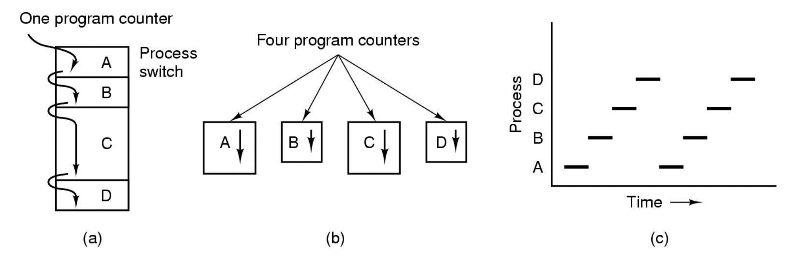
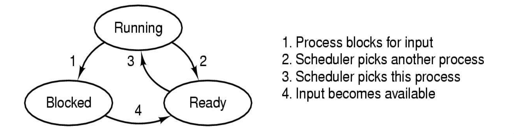
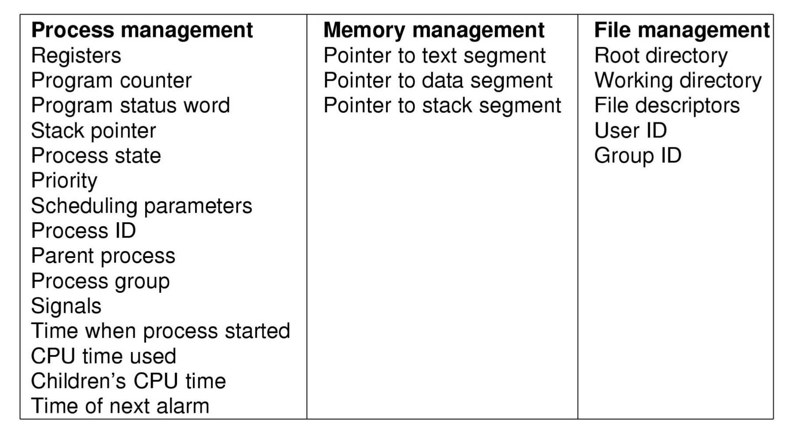

# 프로세스와 스레드

## 프로세스 모델

a. 4가지 프로그램의 Multiprogramming
b. 4개의 독립적인 프로세스 개념 모델
c. 한번에 하나의 프로그램만 실행가능한 모델

## 프로세스

현재 실행중인 프로그램

하나의 프로제스는 `address space(주소 공간)`과 `process table entry`를 갖는다.

> process table entry는 process상태를 저장한다.

## 프로세스의 상태

프로세스는 `Running`, `Ready`, `Blocked`라는 3가지 상태를 갖는다.

- Running : CPU가 해당 프로세스를 수행하고 있는 상태
- Ready : 다른 프로세스를 실행하기위해 잠시 멈춘상태(실행가능한 상태)
- Blocked : 실행 불가능한 상태, 디스크를 읽거나 문자를 입력하는 등의 외부 이벤트가 발생할 때까지 멈춰있는 상태이다.

1. Running Process가 어떤 값을 입력 받기 전까지는 Blocked상태가 된다.
2. 스케쥴러가 다른 프로세스를 선택한 경우 Running 프로세스는 Ready상태가 된다.
3. 스케쥴러에의해 Ready상태의 프로세스를 선택한 경우 다시 Running상태가 된다.
4. 값을 입력받을 경우 Blocked된 프로세스는 Ready상태가 된다.

## 프로세스의 Address Space(주소공간)

<image src = images/address_space.jpeg width = 400>

프로세스의 주소공간은 크게 3가지로 나눌 수 있다.
1. test : 프로그램 코드가 들어가는 부분
2. data : 정적변수에 할당되는 영역이다.
3. stack 

## 프로세스의 계층화

## Protection

## Process Table

- 운영체제가 관리하는 DB, Process당 하나의 entry를 가지고 있다.
- Running상태에서 밀려날 때 저장해둔다.
- 보통 프로세스의 상태, 해당 프로그램 counter, stack pointer, memory allocation등과 같이 실행상태로 돌아가기 위해 가지고 있어야 하는 정보들을 담고 있다.

## Process 생성
새로운 프로세스는 현재 실행하고 있는 프로세스가 프로세스 생성 System Call을 실행할 때만 만들 수 있다.  
프로세스를 생성하는 주요 event들
- System initialization
- 실행중인 프로세스가 프로세스 생성 System Call 명령어를 실행한경우
- 새로운 프로세스를 생성하라는 사용자 요청
- 배치 작업의 시작

## Process의 종료
프로세스를 종료시키는 방법은 크게 `자발적인 경우`와 `비 자발적인 경우`로 나뉜다.

- 자발적인 경우
  - 정상적인 종료
  - 에러에의한 종료

- 비자발적이 경우
  - 치명적인 오류로 인한 종료
  - 다른 프로세스가 해당 프로세스를 죽인경우(kill 명령어)