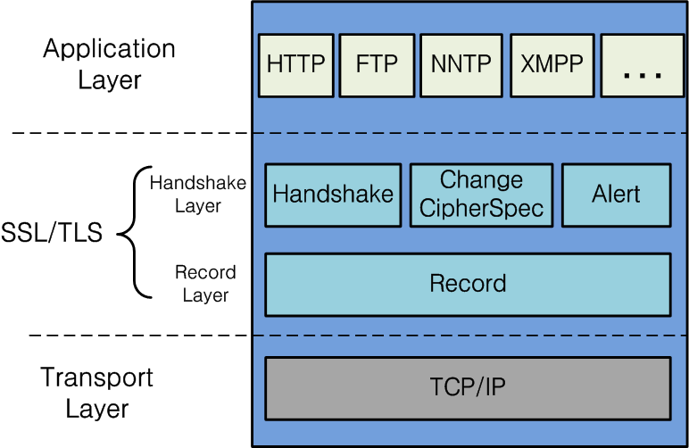

# HTTPS

HTTPS의 마지막 S는 Over Secure Socket Layer의 약자로 보안이 강화된 HTTP라는 것을 알 수 있다.

- ssl/tls에서 http가 작동할 경우 https라고 부른다.
- https와 ssl이 같은 것이 아닌 ssl위에 올라가는 프로토콜 중 하나가 바로 https이다.  

## 암호화 이점
- 기밀성의 원칙에서 보면 통신 내용이 공격자에게 노출(snipping)되는 것을 막을 수 있다.
- 무결성의 원칙에서 보면 통신 내용을 타인이 함부로 변경하는 것을 막을 수 있다.
- 기밀성의 원칙과 무결성의 원칙을 통해 서버와 클라이언트는 서로 신뢰를 할 수 있다.

## SSL (Secure Socket Layer)
- SSL은 원래 Netscape에서 웹 서버와 브라우저 사이의 보안을 위해 만들어진 프로토콜이다. 
- 인증서를 이용해 사용자와 서버를 인증하는데 사용한다.

## TLS (Transport Layer Secure)
네스케이프사에서 발명된 SSL이 국제 인터넷 표준화 기구인 IETF의 관리로 변경되면서 TLS(Transport Layer Secure)로 이름이 바뀌었다. 때문에 SSL 3.0은 TLS 1.0을 계승한다.

## SSL의 암호화 방식
- 대칭키
- 공개키

### 대칭키

문서를 암호화 복호화 할 때 같은 키를 사용한다.

### 공개키

문서를 암호화 복호화 하는데 다른키를 사용한다.

## 인증서의 역할

- 클라이언트가 접속한 서버가 신뢰할 수 있는 서버임을 보장한다.
- SSL 통신에 사용할 공개키를 클라이언트에게 제공한다.

### CA(인증서)

CA안에는 `서비스의 정보`와 `서버 측 공개키`가 들어가 있다.   
서비스 정보를 통해 클라이언트가 접속한 서버가 클라이언트가 의도한 서버가 맞는지에 대한 내용을 담고 있고, 서버 측 공개키를 통해 서버와 통신을 할 때 사용할 공개키와 그 공개키의 암호화 방법들의 정보를 담고 있다.

